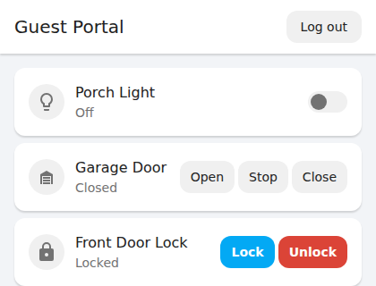
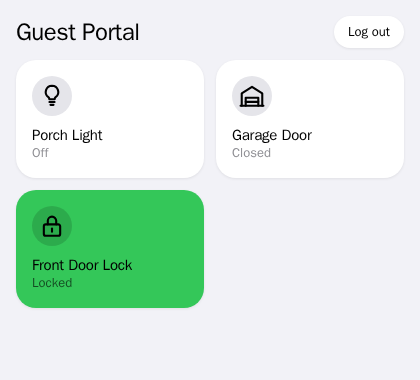
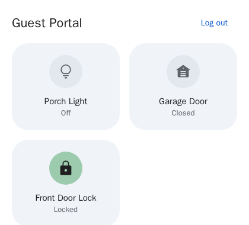

# Home Assistant Guest Portal

**Give your guests the porch light, the front door and the garage — without
giving them your Home Assistant.**

Guest Portal is a small web page you share with the people staying at your
place. They open it on their phone, type the password you gave them, and see
just the devices you picked, with just the buttons you allowed. Unlock the
front door, yes. Lock it, maybe. Open your Home Assistant dashboard, never.

It was built for short-term rentals and vacation homes, but it works just as
well for a house-sitter, a dog walker, or visiting family.

<table>
  <tr>
    <td align="center"><br><b>Classic</b></td>
    <td align="center"><br><b>Tiles</b></td>
    <td align="center"><br><b>Cards</b></td>
  </tr>
</table>

## What you get

- **A page with only what guests need.** You choose each device and each
  action on it. A lock can allow "unlock" without allowing "lock"; a
  garage door can open without being closable.
- **More than one portal.** Run a "Guest House" and a "Barn" side by side,
  each with its own password, its own devices and its own look. The password
  a guest types decides which portal they land on.
- **Three themes**, each switching between light and dark to match the guest's
  phone.
- **A kill switch.** Turn a portal off when guests check out, from the portal
  itself or from a Home Assistant automation. Your own access keeps working.
- **Live updates.** When someone switches the porch light on, every open
  portal shows it within a second or two.
- **Home Assistant knows what's happening.** The optional companion
  integration gives each portal an on/off switch and a "last interaction"
  sensor, so you can get a notification when a guest unlocks the door.
- **An app-like home screen icon** for guests who want to keep it handy.
- **Your Home Assistant stays private.** Guests never see its address, and
  its access token never leaves the server.

> **Good to know:** Guest Portal is meant for your home network. It serves
> plain `http://` and shares one password per portal, so keep it off the
> public internet — no port forwarding. See [Security, in plain
> words](#security-in-plain-words).

## Getting started

There are two ways to install it. Pick the one that matches how you run Home
Assistant:

| You run… | Use |
|---|---|
| **Home Assistant OS** or **Supervised** (you have an Add-on Store) | [The add-on](#option-1-the-home-assistant-add-on-easiest) — easiest, no tokens or config files |
| **Home Assistant Container**, or anything else | [Docker Compose](#option-2-docker-compose) |

### Option 1: The Home Assistant add-on (easiest)

1. **Copy this repository onto your Home Assistant host**, into
   `/addons/ha-guest-portal/`. The Samba share add-on is the easiest way to
   reach that folder. (If you're working from a clone of this repo,
   `scripts/deploy-to-ha.sh` can upload it for you — copy
   `scripts/.env.deploy.example` to `scripts/.env.deploy` and fill it in
   first.)
2. In Home Assistant, go to **Settings → Add-ons → Add-on Store**, open the
   **⋮** menu and choose **Check for updates**.
3. Find **Guest Portal** under **Local add-ons** and install it.
4. *Optional:* set an `admin_password` (at least 8 characters). You only need
   one if you want to manage portals from outside the Home Assistant sidebar.
   Guest passwords don't go here — you'll create those in the portal itself.
5. Start the add-on.

That's it. No Home Assistant token is needed; the Supervisor provides one.

**Where to find it afterwards:**

- **You:** click **Guest Portal** in the Home Assistant sidebar. You're signed
  in as the admin automatically.
- **Your guests:** `http://homeassistant.local:9123` (or your Home Assistant's
  IP address instead of `homeassistant.local`). They sign in with their
  portal's password.

To use a port other than 9123 for guests, change it under the add-on's
**Configuration → Network** panel. Leave the container-side port at 9123.

Now [set up your first portal](#set-up-your-first-portal).

### Option 2: Docker Compose

This runs the portal as its own container next to Home Assistant. It takes
two bits of preparation in Home Assistant first.

**1. Create a Home Assistant user just for the portal.** Go to **Settings →
People**, add a user (for example "Guest Portal Service"), and make sure it is
**not** an administrator or owner. Then sign in as that user and create a
**long-lived access token** from its profile page. Keep the token handy.

<details>
<summary>Why a separate, non-admin user?</summary>

Home Assistant can't limit a token to certain devices — every token can reach
everything its user can. The portal enforces your device list itself, but
giving it a non-admin user means that even if the portal were compromised,
the token couldn't be used to change your Home Assistant setup.

</details>

**2. Find your Home Assistant's IP address**, like `192.168.1.100`. Use the
IP address, not `homeassistant.local`: `.local` names don't resolve inside a
Docker container, so the portal refuses them and tells you why.

**3. Configure and start the portal:**

```bash
git clone https://github.com/ajma/ha-guest-portal.git
cd ha-guest-portal
cp .env.example .env
```

Edit `.env`:

```bash
# Your Home Assistant, by IP address
HA_BASE_URL=http://192.168.1.100:8123
HA_TOKEN=your-long-lived-access-token

# How you sign in as the admin. At least 8 characters, and different from
# every portal's password.
ADMIN_PASSWORD=your-secure-admin-password
```

Then open `docker-compose.yml` and replace `192.168.1.10` with **the IP
address of the machine running the portal**. This keeps it listening on your
home network only. Start it:

```bash
docker compose up -d
```

Open `http://<that-ip>:9123`, sign in with your `ADMIN_PASSWORD`, and
[set up your first portal](#set-up-your-first-portal).

<details>
<summary>Where the data lives, and backups</summary>

Everything is in one SQLite file, stored in a Docker volume named
`portal-data`. To find it on the host:

```bash
docker volume inspect portal-data --format '{{ .Mountpoint }}'
```

**Prefer a normal folder?** Replace `portal-data:/data` in
`docker-compose.yml` with `./data:/data`. The container runs as uid 1000, so
give that user the folder first — otherwise SQLite fails with "unable to open
database file":

```bash
mkdir -p ./data
sudo chown 1000:1000 ./data
```

</details>

<details>
<summary>Running with plain <code>docker run</code> instead</summary>

```bash
docker build -t ha-guest-portal .
docker volume create portal-data

docker run -d \
  --name ha-guest-portal \
  --restart unless-stopped \
  -p 192.168.1.10:9123:9123 \
  -v portal-data:/data \
  --env-file .env \
  ha-guest-portal
```

Replace `192.168.1.10` with your server's IP address. To use a folder instead
of a volume, prepare it as above and pass `-v ./data:/data`.

</details>

## Set up your first portal

A fresh install has no portals yet, so the first thing you see is a
**create-portal** screen.

1. **Name it and give it a password** (at least 8 characters). The password is
   what you'll give your guests.
2. **Add devices.** Click **Edit** in the header, then the **+ Add device**
   tile, and pick something from your Home Assistant.
3. **Decide what guests may do.** Tap the new tile to give it a friendly name
   and tick the actions you want to allow. A new device starts with *nothing*
   allowed, so a lock can never be openable before you've decided it should
   be.
4. Click **Done**.
5. *Optional:* open **▸ Portal settings** under the header to rename the
   portal, pick a theme, or change its password.

There's no Save button — every change takes effect the moment you make it,
and guests see it right away.

**Then share two things with your guests:**

- the address — `http://homeassistant.local:9123` for the add-on, or
  `http://<server-ip>:9123` for Docker
- the portal's password

Want a second portal? Click the portal name in the header and choose
**+ Add portal**.

For a full tour of editing, themes, the kill switch, password changes and
home screen icons, see **[DOCS.md](DOCS.md)**.

## Optional: The Home Assistant integration

The companion integration brings each portal into Home Assistant as its own
device, with:

- a **switch** to turn that portal on and off — from a dashboard, a voice
  assistant, or an automation (say, at checkout time)
- a **sensor** that updates whenever a guest signs in or uses a device

Home Assistant hears about each interaction within about 10 seconds. It
needs Home Assistant **2026.9 or newer**.

### Install it

- **With HACS:** add `https://github.com/ajma/ha-guest-portal` as a custom
  repository of type *Integration*, install **Home Assistant Guest Portal**,
  and restart Home Assistant.
- **By hand:** copy `custom_components/ha_guest_portal/` into your Home
  Assistant's `config/custom_components/` folder and restart.

### Connect it

- **Using the add-on:** Home Assistant finds it for you. After the restart,
  look under **Settings → Devices & Services** for **Home Assistant Guest
  Portal** waiting to be configured, and click **Configure**. No credentials
  needed.
- **Using Docker:** go to **Settings → Devices & Services → Add Integration →
  Home Assistant Guest Portal**, and enter the portal's host, port, and
  integration token. You'll find the token in the portal: click the **⚙** gear,
  then **Show token**.

Each portal's entities are named after the portal when they're first created.
A portal called "Barn" gets `switch.barn` and `sensor.barn_last_interaction`.
Renaming the portal later doesn't rename them, or the device.

### Example: get a notification when a guest uses a device

```yaml
automation:
  - alias: Notify when a guest uses the Barn portal
    triggers:
      - trigger: state
        entity_id: sensor.barn_last_interaction
    conditions:
      - condition: template
        value_template: "{{ state_attr('sensor.barn_last_interaction', 'kind') == 'action' }}"
    actions:
      - action: notify.mobile_app_my_phone
        data:
          message: >-
            Guest used {{ state_attr('sensor.barn_last_interaction', 'label') }}
            ({{ state_attr('sensor.barn_last_interaction', 'action') }})
```

The sensor's attributes are `kind` (`action` or `login`), `target_entity_id`,
`label`, `action`, and `ok`. For a login, the three device attributes are
`null`.

## Upgrading from a single-portal version

> [!WARNING]
> **This version can't read the old database, and it won't tell you.** Earlier
> versions had one shared portal; this one has many, and the database changed
> to match. There is no migration.

If you upgrade without clearing the old database, everything *looks* fine:
the portal starts, your old portal seems to have vanished, and you can create
a new one. Then the first time you open its device list, or a guest signs in,
you get a `no such column: portal_id` error.

**To upgrade cleanly:**

1. Stop the add-on or container.
2. Delete the database file — `/data/portal.db` in the add-on, or the same
   file in your Docker volume or folder.
3. Start it again and re-create your portals. Old passwords can't be
   recovered, so each one gets a new password.
4. **Re-pair the Home Assistant integration**, because deleting the database
   also resets the integration token. The add-on is rediscovered
   automatically after a restart; with Docker, remove the integration and add
   it again with the new token.

[DOCS.md](DOCS.md#upgrading-from-a-single-portal-version) walks through it in
more detail.

## Troubleshooting

**The portal won't start, and the log mentions `ADMIN_PASSWORD`.** It refuses
to start in two cases, both on purpose:

- **The admin password is under 8 characters.** The log says `Too small:
  expected string to have >=8 characters → at ADMIN_PASSWORD`. Make it longer
  — in the add-on's `admin_password` option, or in `.env`.
- **The admin password matches a portal's password.** The log says
  `ADMIN_PASSWORD is also the guest password for "<portal name>"`. If the
  portal started anyway, that portal's guests would be signed in as admin
  over *every* portal. Change either password and restart.

**A device shows as unavailable, with a red outline in Edit mode.** It was
renamed or removed in Home Assistant, so the portal can't find it any more.
Remove that tile and add the device again under its new name.

**Guests can't install the portal as an app on Android.** Browsers only offer
to install web apps from an `https://` address, and the portal serves plain
`http://`. iPhones and iPads can still add a home screen icon. To get the full
experience everywhere, put the portal behind a reverse proxy with HTTPS. See
[DOCS.md](DOCS.md#add-the-portal-to-your-home-screen).

**Devices say "Unknown".** The portal has lost its live connection to Home
Assistant, so it can't tell what state anything is in. It keeps retrying on
its own, and guests' buttons still work in the meantime. If it never comes
back and you're using Docker, check that `HA_BASE_URL` is right and that
`HA_TOKEN` is still valid — the portal stops retrying once Home Assistant
rejects its token.

## Security, in plain words

Guest Portal assumes it lives on a home network you trust, behind a router
that doesn't forward any ports to it.

**What it does to keep things safe:**

- **Guests only get what you allowed.** The device list and allowed actions
  are enforced by the server, not just hidden in the page.
- **Your Home Assistant token never reaches a browser.**
- **A portal password never opens the admin view.** Managing portals takes
  the Home Assistant sidebar or the admin password.
- **Each portal can be switched off instantly**, and changing a portal's
  password signs out everyone using the old one.
- **It listens only on your home network** — the Docker setup binds it to one
  LAN address on purpose.

**What it deliberately doesn't do, so you can decide what to expose:**

- **Passwords are shared.** Anyone with a portal's password can use every
  device on that portal, including locks. Only add devices you're
  comfortable letting any guest of that portal control.
- **No HTTPS.** Traffic is plain HTTP, protected only by being on your home
  network. Session cookies are HttpOnly and SameSite=Lax, but can't be marked
  Secure without HTTPS.
- **Home Assistant tokens can't be limited to certain devices.** That's why
  the Docker setup uses a non-admin user.
- **Whoever controls the host controls the portal.** Anyone who can run
  `docker inspect` on the host can read the token and admin password, and the
  database holds every portal's password. For the add-on, anyone who can
  change the add-on's configuration has the same reach.

## Reference

### Environment variables (Docker)

| Variable | Required | Default | What it's for |
|----------|----------|---------|---------------|
| `HA_BASE_URL` | Yes | — | Your Home Assistant's address, by IP (not `.local`) |
| `HA_TOKEN` | Yes | — | Long-lived access token from a non-admin Home Assistant user |
| `ADMIN_PASSWORD` | Outside the add-on | — | Admin sign-in password. At least 8 characters, and different from every portal's password. Optional in the add-on, where the Home Assistant sidebar signs you in; with neither, the portal refuses to start, since no one could create a portal |
| `PORT` | No | `9123` | Port to listen on |
| `DB_PATH` | No | `/data/portal.db` | Where the SQLite database lives |
| `HA_WS_URL` | No | — | Override the WebSocket address (advanced) |
| `TRUST_PROXY` | No | — | Trust proxy headers, e.g. `loopback` |

### Health check

`GET /api/health` needs no sign-in and returns:

```json
{ "ok": true, "haStale": false }
```

`ok: true` means the portal is running. `haStale: true` means its live
connection to Home Assistant has dropped (devices can still be operated).
The Docker health check uses this endpoint, and deliberately stays healthy
when `haStale` is true — restarting the portal wouldn't fix Home Assistant's
connection.

## Contributing

Development setup, the theme-preview baselines, and the release checklist are
in **[CONTRIBUTING.md](CONTRIBUTING.md)**.

## Support

This software is provided as-is. For help with Home Assistant itself, see the
[Home Assistant documentation](https://www.home-assistant.io/docs/).
